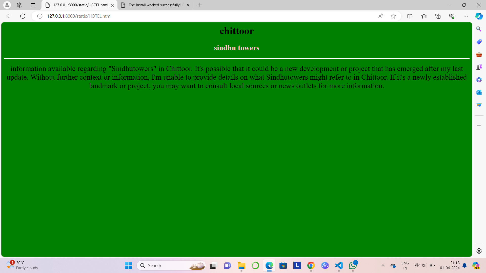
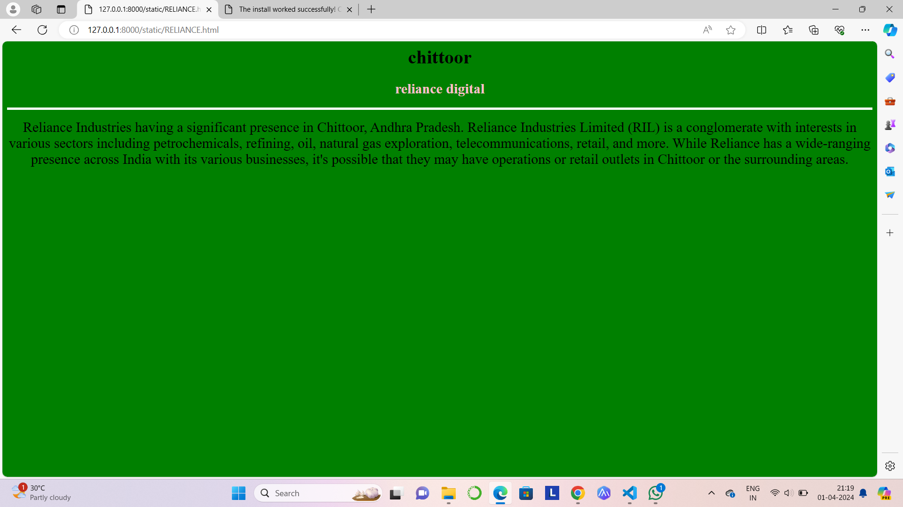
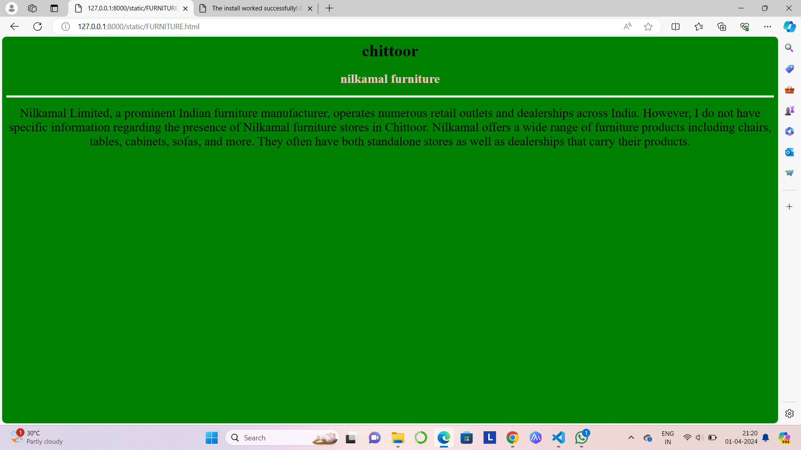
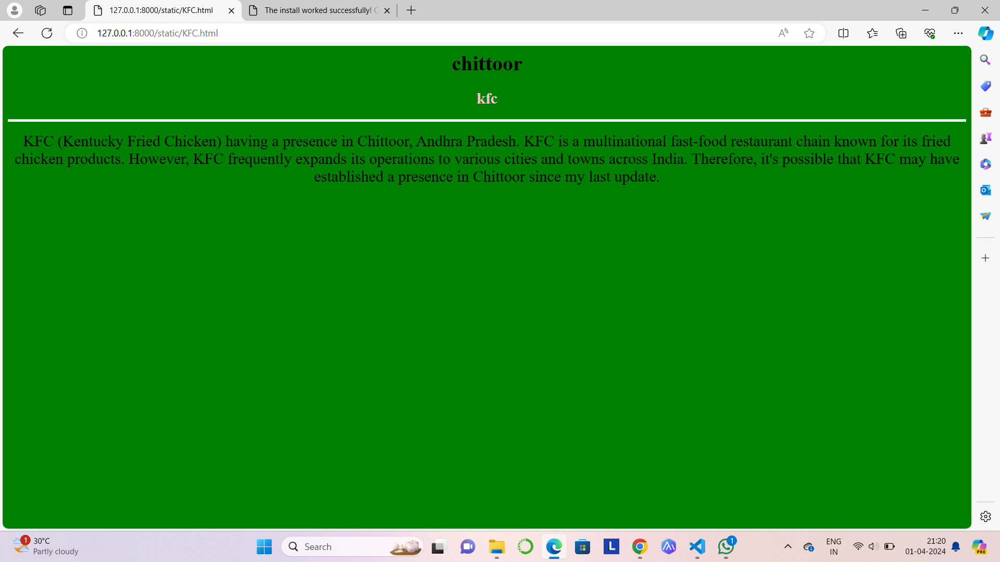

# Ex04 Places Around Me
## Date: 01/04/2024

## AIM
To develop a website to display details about the places around my house.

## DESIGN STEPS

### STEP 1
Create a Django admin interface.

### STEP 2
Download your city map from Google.

### STEP 3
Using ```<map>``` tag name the map.

### STEP 4
Create clickable regions in the image using ```<area>``` tag.

### STEP 5
Write HTML programs for all the regions identified.

### STEP 6
Execute the programs and publish them.

## CODE

```
<html>
    <title>Mycity</title>
    <body bgcolor="white">
        <h1 align="center"><font color="blue">chittoor</font></h1>
        <h3 align="center">
            <font color="blue">E.MYTHRI(212223240034)</font></h3>
        <center>
            
            <map name="MyCity">
                    <area shape="rect" coords="350,220,400,270" href="HOTEL.html" title="sindhu towers">     
                    <area shape="rect" coords="750,270,850,350" href="PARK.html" title="deer park">
                    <area shape="rect" coords="400,600,500,650" href="RELIANCE.html" title="reliance digital">
                    <area shape="rect" coords="1100,250,900,300" href="FURNITURE.html" title="nilkamal furniture">
                    <area shape="rect" coords="800,300,750,350" href="KFC.html" title="kfc">
            </map>
        </center>
       

    </body>
</html>


<html>
    <h1 align="center">
        <font face="Times New Roman" color="black" size="6">chittoor</font>
    </h1>
    <h3 align="center">
        <font face="Times New Roman" color="pink" size="5.5">deer park</font>
    </h3>
    <body bgcolor="green" align="center">
        <hr size="4" color="white">
        <p align="center">
        <font face="Times New Roman" size="5">
            "Deer Park" in Chittoor. It's possible that a deer park could have been established after my last update or it may not be widely known or recognized.

            Deer parks are typically areas where deer are kept for conservation, educational, or recreational purposes. 
            They often provide opportunities for visitors to observe and learn about deer and other wildlife in their natural habitat.
        </font>
        </p>
    </body>
</html>


<html>
    <h1 align="center">
        <font face="Times New Roman" color="black" size="6">chittoor</font>
    </h1>
    <h3 align="center">
        <font face="Times New Roman" color="pink" size="5.5">sindhu towers</font>
    </h3>
    <body bgcolor="green" align="center">
        <hr size="4" color="white">
        <p align="center">
        <font face="Times New Roman" size="5">
            information available regarding "Sindhutowers" in Chittoor.
             It's possible that it could be a new development or project that has emerged after my last update. 
             Without further context or information, I'm unable to provide details on what Sindhutowers might refer to in Chittoor.
              If it's a newly established landmark or project, you may want to consult local sources or news outlets for more information.

        </font>
        </p>
    </body>
</html>


<html>
    <h1 align="center">
        <font face="Times New Roman" color="black" size="6">chittoor</font>
    </h1>
    <h3 align="center">
        <font face="Times New Roman" color="pink" size="5.5">reliance digital</font>
    </h3>
    <body bgcolor="green" align="center">
        <hr size="4" color="white">
        <p align="center">
        <font face="Times New Roman" size="5">
            Reliance Industries having a significant presence in Chittoor, Andhra Pradesh. 
            Reliance Industries Limited (RIL) is a conglomerate with interests in various sectors including petrochemicals, refining, oil, natural gas exploration, telecommunications, retail, and more.
             While Reliance has a wide-ranging presence across India with its various businesses, it's possible that they may have operations or retail outlets in Chittoor or the surrounding areas.
        </font>
        </p>
    </body>
</html>


<html>
    <h1 align="center">
        <font face="Times New Roman" color="black" size="6">chittoor</font>
    </h1>
    <h3 align="center">
        <font face="Times New Roman" color="pink" size="5.5">nilkamal furniture</font>
    </h3>
    <body bgcolor="green" align="center">
        <hr size="4" color="white">
        <p align="center">
        <font face="Times New Roman" size="5">
            Nilkamal Limited, a prominent Indian furniture manufacturer, operates numerous retail outlets and dealerships across India. 
            However, I do not have specific information regarding the presence of Nilkamal furniture stores in Chittoor.
            Nilkamal offers a wide range of furniture products including chairs, tables, cabinets, sofas, and more. 
            They often have both standalone stores as well as dealerships that carry their products.
        </font>
        </p>
    </body>
</html>


<html>
    <h1 align="center">
        <font face="Times New Roman" color="black" size="6">chittoor</font>
    </h1>
    <h3 align="center">
        <font face="Times New Roman" color="pink" size="5.5">kfc</font>
    </h3>
    <body bgcolor="green" align="center">
        <hr size="4" color="white">
        <p align="center">
        <font face="Times New Roman" size="5">
            KFC (Kentucky Fried Chicken) having a presence in Chittoor, Andhra Pradesh. 
            KFC is a multinational fast-food restaurant chain known for its fried chicken products.
            However, KFC frequently expands its operations to various cities and towns across India.
            Therefore, it's possible that KFC may have established a presence in Chittoor since my last update.
        </font>
        </p>
    </body>
</html>

```

## OUTPUT

.png>)










## RESULT
The program for implementing image maps using HTML is executed successfully.
